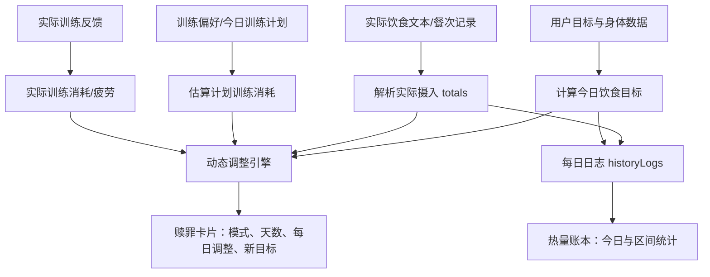

# 健身日历 APP：特色动态调整机制专家审核包

生成日期：2026-07-05  
用途：提交给营养、训练、产品或算法专家审核。  
审核重点：这套机制是否符合营养学、训练恢复和真实用户执行习惯；是否存在逻辑漏洞、极端场景风险或需要调整的安全阈值。

---

## 1. 功能定位

本 APP 的“特色动态调整”不是金融债务系统，也不是惩罚系统。产品层可以使用较戏谑的用户标签“赎罪”，但底层逻辑定义为：

- 记录用户当日实际摄入、目标摄入、训练计划与实际训练之间的差额。
- 对热量差额进行可解释、可限制的跨天处理。
- 对蛋白质、脂肪、碳水只做趋势查看和温和建议，不生成短期硬性“偿还”任务。
- 对训练缺口保持谨慎，不鼓励把多日未训练量集中到某一天一次性补完。

当前信息架构：

- 饮食首页负责记录实际饮食、餐次、今日营养统计，并保存每日日志。
- 底部新增一级标签“赎罪”。
- “赎罪”页集中展示动态调整卡片和热量账本。
- “更多”页提供动态调整高级规则开关。

---

## 2. 相关代码文件

### 共享逻辑 / 规则引擎

- `C:\Users\Administrator\Documents\健身日历\shared\dynamic-plan-engine.ts`
- `C:\Users\Administrator\Documents\健身日历\shared\calorie-debt-ledger.ts`
- `C:\Users\Administrator\Documents\健身日历\shared\dynamic-plan-engine.test.ts`
- `C:\Users\Administrator\Documents\健身日历\shared\calorie-debt-ledger.test.ts`

### 移动端状态与功能封装

- `C:\Users\Administrator\Documents\健身日历\apps\mobile\features\adjustments.ts`
- `C:\Users\Administrator\Documents\健身日历\apps\mobile\store\fitness-store.ts`

### 移动端页面 / UI

- `C:\Users\Administrator\Documents\健身日历\apps\mobile\app\(tabs)\index.tsx`
- `C:\Users\Administrator\Documents\健身日历\apps\mobile\app\(tabs)\atonement.tsx`
- `C:\Users\Administrator\Documents\健身日历\apps\mobile\app\(tabs)\more.tsx`
- `C:\Users\Administrator\Documents\健身日历\apps\mobile\components\CalorieLedgerPanel.tsx`

---

## 3. 核心数据流



---

## 4. 动态调整输入

共享引擎入口：

```ts
calculateDynamicPlanAdjustment(input: DynamicPlanEngineInput): DynamicPlanEngineResult
```

主要输入：

- `userProfile`：性别、年龄、身高、体重、训练水平。
- `goalPlan`：目标体重、目标天数、目标体型。
- `nutritionLedger.target`：今日目标热量与宏量营养。
- `nutritionLedger.actual`：实际摄入热量、蛋白、脂肪、碳水。
- `nutritionLedger.mealDeltas`：早餐、午餐、晚餐、加餐相对预算的热量差额。
- `trainingLedger.plannedCalories`：计划训练消耗。
- `trainingLedger.actualCalories`：实际训练消耗。
- `trainingLedger.plannedFocus`：计划训练部位。
- `trainingLedger.fatigue`：疲劳反馈。
- `adjustmentRules`：安全阈值与动态规则。
- `atonementPreference`：用户选择的处理模式与自定义天数。

---

## 5. 默认规则

来自 `createDefaultAdjustmentRules(settings, gender)`：

| 项目 | 当前值 |
|---|---:|
| 女性最低摄入保护 | 1200 kcal/天 |
| 男性最低摄入保护 | 1500 kcal/天 |
| 最小自动调整天数 | 3 天 |
| 最大自动调整天数 | 7 天 |
| 估算每个调整日可处理热量 | 180 kcal |
| 每日最高偿还热量 | 400 kcal |
| 每日最高偿还比例 | 目标热量的 20% |
| 混合模式默认偿还比例 | 50% |
| 训练日碳水倾向系数 | 1.12 |
| 休息日碳水倾向系数 | 0.88 |
| 疲劳优先顺延阈值 | fatigue >= 4 |

默认动态开关：

- 饮食：热量、蛋白、脂肪、碳水全部开启。
- 餐次：早餐、午餐、晚餐、加餐全部开启。
- 训练：训练消耗、训练顺延、疲劳恢复全部开启。
- 训练部位：胸、背、腿、肩、手臂、核心、有氧全部开启。

默认“赎罪”偏好：

```ts
{
  adjustmentMode: "hybrid",
  repayDays: 5
}
```

---

## 6. 三种处理模式

### 6.1 延长目标天数

内部模式：`extend-deadline`

含义：

- 后续每日摄入不压低。
- 多出来的热量不分摊到每天扣减。
- 通过延长目标完成时间处理。

核心计算：

```ts
dailyRepayCalories = 0
deadlineExtensionDays = ceil(netDelta / dailyDeficit)
unresolvedCalories = netDelta
adjustedDailyCalories = 原目标热量
```

示例：

- 目标 2200 kcal/天。
- 每日目标缺口 500 kcal。
- 当天净多 2000 kcal。
- 延长天数 = `ceil(2000 / 500) = 4` 天。

### 6.2 往后天数分摊

内部模式：`repay-by-days`

含义：

- 用户指定天数。
- 系统把净多摄入热量平均分摊到这些天里扣减。
- 受最低摄入保护、每日最高偿还热量、目标热量比例上限限制。

核心计算：

```ts
preferredDays = clamp(userRepayDays, 1, 30)
safeDailyCap = min(400, targetCalories * 20%, targetCalories - safetyFloor)
dailyRepayCalories = min(safeDailyCap, ceil(netDelta / preferredDays))
unresolvedCalories = max(0, netDelta - dailyRepayCalories * preferredDays)
deadlineExtensionDays = unresolvedCalories > 0 ? ceil(unresolvedCalories / dailyDeficit) : 0
```

示例：

- 当天净多 2000 kcal。
- 用户选择 5 天。
- 每天偿还 = 400 kcal。
- 若不触发安全限制，则 5 天还完。

### 6.3 延长加分摊

内部模式：`hybrid`

含义：

- 默认推荐模式。
- 一部分热量分摊到用户指定天数。
- 剩余热量通过延长目标天数处理。
- 目的是降低后续几天饮食压力，避免过度压低摄入。

核心计算：

```ts
targetRepayCalories = round(netDelta * 50%)
dailyRepayCalories = min(safeDailyCap, ceil(targetRepayCalories / preferredDays))
unresolvedCalories = max(0, netDelta - dailyRepayCalories * preferredDays)
deadlineExtensionDays = unresolvedCalories > 0 ? ceil(unresolvedCalories / dailyDeficit) : 0
```

示例：

- 当天净多 2000 kcal。
- 用户选择 5 天。
- 混合模式先偿还 50%，即 1000 kcal。
- 每天扣减 200 kcal，剩余 1000 kcal 顺延。
- 若每日缺口 500 kcal，则顺延 2 天。

---

## 7. 净差计算规则

### 7.1 饮食差额

当前逻辑：

```ts
actualIntake = actualFoodIsDelta
  ? targetCalories + actual.calories
  : actual.calories

totalFoodDelta = actualIntake - targetCalories

foodDelta = mealDeltas.reduce(...) || totalFoodDelta
```

说明：

- 优先使用餐次差额。
- 如果餐次差额求和为 0，则回退到总摄入差额。
- 用户可在高级规则里关闭某些餐次参与动态调整。

需要专家重点审核：

- 当用户关闭某些餐次后，`reduce(...) || totalFoodDelta` 是否可能在剩余餐次求和为 0 时错误回退到总差额，从而把已关闭餐次重新纳入调整。
- 对“餐次关闭”的产品语义应定义为“不显示建议”还是“不参与计算”。

### 7.2 训练差额

当前逻辑：

```ts
trainingDelta = plannedCalories - actualCalories
netDelta = foodDelta + trainingDelta
```

含义：

- 如果计划训练 400 kcal，但实际只练 100 kcal，则训练差额为 +300 kcal。
- 这会增加当天净差。
- 如果实际训练超过计划，则训练差额为负，降低净差。

注意：

- 热量账本不把训练记录作为“热量债务来源”累计。
- 但动态调整当天预览会把计划训练与实际训练差额纳入净差。
- 当前没有生成“补训练任务”，避免鼓励集中补练。

需要专家重点审核：

- 对普通减脂用户，未完成训练是否应该全部折算为热量差额。
- 对增肌或维持用户，训练少做是否应该更多体现在训练计划顺延，而不是饮食热量扣减。

### 7.3 疲劳保护

如果：

```ts
settings.training.fatigue === true
fatigue >= 4
netDelta > 0
```

则强制使用 `extend-deadline`。

产品含义：

- 疲劳偏高时，不继续压低摄入。
- 不建议加练。
- 优先顺延目标。

---

## 8. 宏量营养分配规则

函数：

```ts
adjustMacros(target, adjustedDailyCalories, trainingLedger, rules)
```

当前策略：

1. 先保留或提高蛋白：

```ts
proteinG = max(target.proteinG, round(adjustedCalories * 25% / 4))
```

2. 根据训练日/休息日调整脂肪、碳水倾向：

- 有计划训练：碳水倾向更高。
- 无计划训练：碳水倾向更低，脂肪相对保留。

3. 设置基础下限：

- 脂肪最低 20g。
- 碳水最低 60g。
- 休息日脂肪参考基线至少 35g。

4. 最终尽量保证：

```ts
proteinG * 4 + fatG * 9 + carbsG * 4 ≈ adjustedDailyCalories
```

已测试：

- 训练日和休息日宏量热量闭合。
- 关闭脂肪/碳水调整时仍保持热量闭合。

需要专家重点审核：

- 对女性、低体重用户、长期低热量用户，脂肪最低 20g 是否过低。
- 蛋白永远不低于原目标是否可能在低热量日挤压脂肪/碳水过多。
- `25% 热量来自蛋白` 与 `不低于目标蛋白` 叠加后，是否需要按体重设置更明确范围，例如 g/kg。
- 碳水最低 60g 是否适合所有饮食方案，包括低碳和生酮。

---

## 9. 热量账本

函数：

```ts
buildCalorieLedgerTimeline(historyLogs, window)
```

用途：

- 统计指定区间内热量多摄入、少摄入、净差。
- 展示今日摄入与目标对比。
- 展示蛋白、脂肪、碳水趋势。

支持窗口：

- 最近 7 天。
- 最近 14 天。
- 最近 30 天。
- 全部。

输出字段：

- `totalOverCalories`：区间内累计多摄入。
- `totalUnderCalories`：区间内累计少摄入。
- `netCaloriesDelta`：净差。
- `averageDailyCalorieDelta`：平均每日差额。
- `suggestedDailyCalorieAdjustment`：建议每日温和调整值。
- `macroStats`：蛋白、脂肪、碳水趋势。
- `dayEntries`：逐日条目。

热量建议规则：

```ts
raw = ceil(abs(netCaloriesDelta) / 7)
suggestedDailyCalorieAdjustment = min(300, max(50, raw))
```

宏量趋势规则：

| 项目 | 容忍范围 | 每日安全调整参考 |
|---|---:|---:|
| 蛋白质 | ±10g/天 | 25g/天 |
| 脂肪 | ±5g/天 | 10g/天 |
| 碳水 | ±15g/天 | 35g/天 |

宏量账本原则：

- 不把蛋白、脂肪、碳水亏空当作必须一次性补齐的债务。
- 蛋白不足时建议后续每天增加不超过 25g，并分到 2-4 餐。
- 脂肪不足时建议恢复到每日目标附近，不建议短期集中高脂补偿。
- 碳水不足时建议优先放在训练日前后补足，不建议一次性吃回。

---

## 10. UI 展示

### 10.1 赎罪页

页面：`apps/mobile/app/(tabs)/atonement.tsx`

主要展示：

- 页面标题：赎罪。
- 副标题：热量账本 · 动态调整。
- 动态调整卡片：
  - 净差。
  - 用户自定义天数。
  - 系统延长天数。
  - 混合总天数。
  - 每日调整。
  - 新目标。
- 三个模式按钮：
  - 延长目标天数。
  - 往后天数分摊。
  - 延长加分摊。
- 当模式不是“延长目标天数”时，允许用户输入分摊天数。

### 10.2 饮食首页

页面：`apps/mobile/app/(tabs)/index.tsx`

饮食首页保留：

- 热量、蛋白、脂肪、碳水四项统计。
- 点击任一项可以查看该项来源详情。
- 详情支持：
  - 实际 / 目标 / 差额。
  - 按食物 / 按餐次。
- 蛋白、脂肪、碳水详情只显示对应营养项，不额外显示热量。

### 10.3 更多页

页面：`apps/mobile/app/(tabs)/more.tsx`

提供：

- 动态调整总开关。
- 高级规则：
  - 饮食数据开关。
  - 餐次范围开关。
  - 训练数据开关。
  - 训练部位开关。

---

## 11. 已有自动化测试覆盖

### 动态调整引擎

文件：`shared/dynamic-plan-engine.test.ts`

覆盖点：

- 宏量营养热量闭合。
- 动态调整后的每日热量与宏量反算一致。
- 2000 kcal 多摄入，用户选择 5 天偿还，每天 400 kcal。
- 顺延目标时不压低每日摄入。
- 默认混合处理时部分扣减、剩余顺延。
- 混合模式尊重用户指定天数。
- 非法天数不会污染计算结果。
- 低于目标时不奖励性补吃。
- 疲劳偏高时优先顺延目标。
- 营养子开关关闭时仍保持宏量热量闭合。

### 热量账本

文件：`shared/calorie-debt-ledger.test.ts`

覆盖点：

- 按区间统计多摄入、少摄入和净差。
- 蛋白质亏空只给分餐补足建议，不生成一次性补偿任务。
- 脂肪连续偏低时提示恢复每日目标，不要求短期集中高脂补偿。
- 训练记录不会作为热量账本的补偿来源累计。
- 旧函数名 `buildCalorieDebtTimeline` 仍兼容，但返回热量账本语义。

### 移动端路由

文件：`apps/mobile/features/__tests__/route-imports.test.ts`

覆盖点：

- `赎罪页`静态路由存在。

---

## 12. 已知风险与建议专家重点审核点

### P0/P1：科学性与安全边界

1. 维持体重或增肌目标下，`deadlineExtensionDays = ceil(netDelta / dailyDeficit)` 可能不适用。
   - 如果 `dailyDeficit` 为 0 或很小，当前代码用 `max(1, dailyDeficit)` 兜底，可能导致顺延天数异常大或语义不清。
   - 建议专家判断：增肌场景下“多摄入”是否应被视作债务，还是只作为趋势提醒。

2. 蛋白优先策略可能过强。
   - 当前蛋白不低于原目标，并可能提高到热量 25%。
   - 在低热量目标下可能挤压脂肪和碳水。
   - 建议按体重、训练水平、目标阶段设置上下限。

3. 脂肪最低 20g 可能偏低。
   - 对多数成年人，长期 20g/天可能不适合作为默认安全值。
   - 当前热量账本趋势里脂肪安全调整为 10g/天，但宏量分配最低值仍需复核。

4. 训练缺口是否应该折算为热量净差需要复核。
   - 当前 `trainingDelta = plannedCalories - actualCalories`。
   - 对疲劳高用户会强制顺延。
   - 对普通用户仍可能把未训练转成饮食扣减或目标顺延。

### P2：算法细节

1. 餐次差额回退逻辑可能有边界问题：

```ts
mealDeltas.reduce(...) || totalFoodDelta
```

如果部分餐次被关闭，且剩余餐次求和为 0，可能回退到总差额，从而违背用户关闭餐次的意图。

2. 混合模式固定偿还 50% 可能过于单一。
   - 可以考虑根据净差大小、BMI、目标类型、疲劳、历史执行率动态调整比例。

3. 每日偿还上限固定 400 kcal 与 20% 目标热量。
   - 对低体重、低热量用户，20% 已有限制。
   - 对高体重、高热量用户，400 kcal 是否过低或合适需专家判断。

4. `maxAdjustmentDays` 为 7，但用户分摊天数可到 30。
   - 自动默认天数和用户自定义天数边界不同，产品上需要解释清楚。

### P3：产品与 UX

1. “赎罪”是刻意保留的戏谑命名，但专家需评估是否可能对饮食障碍风险用户造成心理压力。
2. 当前 UI 把“延长目标天数 / 往后天数分摊 / 延长加分摊”直接暴露给用户，建议审核是否足够直观。
3. 热量账本突出“今日热量”是正确方向，但区间趋势需要避免给用户制造过强负罪感。
4. 5 个底部标签可能在小屏设备上拥挤，需要视觉验收。

---

## 13. 建议专家回答的问题

请专家优先从以下问题给出结论：

1. 这套机制是否适合作为普通健身饮食 APP 的默认动态调整逻辑？
2. “热量可以跨天平滑，宏量营养只做趋势建议”的原则是否科学？
3. 每日最多扣减 400 kcal、最多 20% 目标热量、男女最低摄入 1500/1200 kcal 是否合适？
4. 混合模式默认偿还 50%、剩余顺延是否合理？
5. 蛋白、脂肪、碳水的趋势容忍范围和每日安全调整参考是否合适？
6. 训练缺口是否应该进入热量净差？哪些情况下应该只顺延训练计划而不影响饮食？
7. 对减脂、维持、增肌三种目标，是否应该使用不同动态调整规则？
8. “赎罪”这个产品名称是否可以保留？如果保留，是否需要增加健康提醒或更柔和的解释？

---

## 14. 当前实现结论

当前实现已经满足的方向：

- 支持用户选择三种处理模式。
- 支持用户自定义分摊天数。
- 支持系统计算顺延天数。
- 支持混合处理。
- 有最低摄入保护和每日偿还上限。
- 疲劳偏高时优先顺延，不继续压低摄入。
- 热量账本可以按区间查看多摄入、少摄入和净差。
- 蛋白、脂肪、碳水只做趋势建议，不做短期硬性偿还。
- 训练记录不作为热量账本债务来源累计。

当前最需要审核和优化的方向：

- 不同目标类型下的顺延和偿还逻辑。
- 宏量营养上下限是否足够科学。
- 餐次关闭后的差额回退逻辑。
- 训练缺口与饮食调整之间的关系。
- “赎罪”命名的心理影响和健康提示策略。

